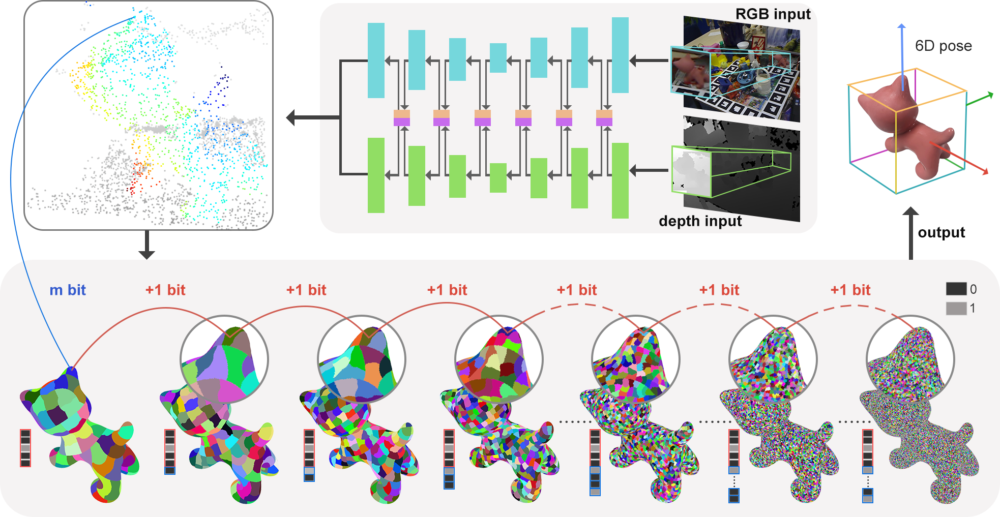

# HiPose

The repository is not ready, please wait!

The implementation of the paper 'HiPose: Hierarchical Binary Surface Encoding and Correspondence Pruning for RGB-D 6DoF Object Pose Estimation' (CVPR2024). [`ArXiv`](https://arxiv.org/abs/2311.12588)



## Installation
- CUDA 11.1 or 11.6 (other versions may also work)
- torch 1.13.1 and torchvision 0.14.1 (other versions may also work)
- Set up python3 environment from requirement.txt:
```
apt-get install -y libgl1-mesa-glx  # need by open3d
pip3 install -r requirement.txt
```
- Install [normalSpeed](https://github.com/hfutcgncas/normalSpeed), a fast and light-weight normal map estimator:
  ```shell
  git clone https://github.com/hfutcgncas/normalSpeed.git
  cd normalSpeed/normalSpeed
  python3 setup.py install --user
  cd ../..
  ```
- Compile [RandLA-Net](https://github.com/qiqihaer/RandLA-Net-pytorch) operators:
  ```shell
  cd hipose/models/RandLA/
  apt-get update
  apt-get install -y build-essential
  pip install Cython
  sh compile_op.sh
  ```
- Install [`bop_toolkit`](https://github.com/thodan/bop_toolkit)
  ```shell
  git clone https://github.com/thodan/bop_toolkit.git
  cd bop_toolkit
  pip install -r requirements.txt -e .
  cd ..
  ```

## Data preparation
1. Download the dataset from [`BOP benchmark`](https://bop.felk.cvut.cz/datasets/), wherein our current focus lies on the LMO, TLESS, and YCBV datasets. Feel free to obtain any one of these datasets for the purpose of testing.
2. Download required ground truth folders of zebrapose from [`owncloud`](https://cloud.dfki.de/owncloud/index.php/s/zT7z7c3e666mJTW). The folders are `models_GT_color`, `XX_GT` (e.g. `train_real_GT` and `test_GT`) and `models` (`models` is optional, only if you want to generate GT from scratch, it contains more files needed to generate GT, but also contains all the origin files from BOP).

3. The expected data structure: 
    ```
    .
    └── BOP ROOT PATH/
        ├── lmo   
        ├── ycbv/
        │   ├── models            #(from step 1 or step 2)
        │   ├── models_eval
        │   ├── models_fine
        │   ├── test              #(testing datasets)
        │   ├── train_pbr         #(training datasets)
        │   ├── train_real        #(not needed; we exclusively trained on PBR data.)
        │   ├── ...               #(other files from BOP page)
        │   ├── models_GT_color   #(from step 2)
        │   ├── train_pbr_GT      #(from step 2)
        │   ├── train_real_GT     #(from step 2)
        │   └── test_GT           #(from step 2)
        └── tless
    ```
4. (Optional) Instead of download the ground truth, you can also generate them from scratch, details in [`Generate_GT.md`](Binary_Code_GT_Generator/Generate_GT.md). 

### Training
Adjust the paths in the config files, and train the network with `train.py`, e.g.
`python train.py --cfg config/bop_lmo_config.txt --obj_name ape`
`python train.py --cfg config/bop_ycbv_config.txt --obj_name wood_block`

The script will save the last 3 checkpoints and the best checkpoint, as well as tensorboard log. 

## Test with trained model
For most datasets, a specific object occurs only once in a test images. 
`python test.py --cfg config/bop_ycbv_config.txt --obj_name wood_block --ckpt_file /path/to/ckpt/like/ycbv/wood_block/1_0000step207000 --eval_output /path/to/eval_output --new_solver_version True --region_bit 10`
Download our trained model from this [`link`](https://1drv.ms/f/s!At2pVfImERx7cM_BVybbo-ThTP4?e=wfbikU).

## Evaluate for BOP challange 
Merge the `.csv` files generated in the last step using `tools_for_BOP/merge_csv.py`, e.g.

`python merge_csv.py --input_dir /dir/to/pose_result_bop/lmo --output_fn hipose_lmo-test.csv`
We also provide our csv files from this [`link`](https://1drv.ms/f/s!At2pVfImERx7cM_BVybbo-ThTP4?e=wfbikU).

And then evaluate it according to [`bop_toolkit`](https://github.com/thodan/bop_toolkit).

## Acknowledgement
Some code are adapted from [`ZebraPose`](https://github.com/suyz526/ZebraPose), [`FFB6D`](https://github.com/ethnhe/FFB6D), [`Pix2Pose`](https://github.com/kirumang/Pix2Pose), [`SingleShotPose`](https://github.com/microsoft/singleshotpose), [`GDR-Net`](https://github.com/THU-DA-6D-Pose-Group/GDR-Net).
## Citation
```
@misc{lin2023hipose,
      title={HiPose: Hierarchical Binary Surface Encoding and Correspondence Pruning for RGB-D 6DoF Object Pose Estimation}, 
      author={Yongliang Lin and Yongzhi Su and Praveen Nathan and Sandeep Inuganti and Yan Di and Martin Sundermeyer and Fabian Manhardt and Didier Stricke and Jason Rambach and Yu Zhang},
      year={2023},
      eprint={2311.12588},
      archivePrefix={arXiv},
      primaryClass={cs.CV}
}
```
